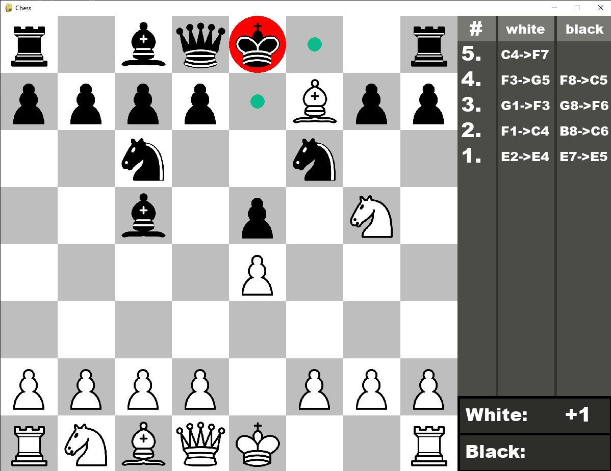
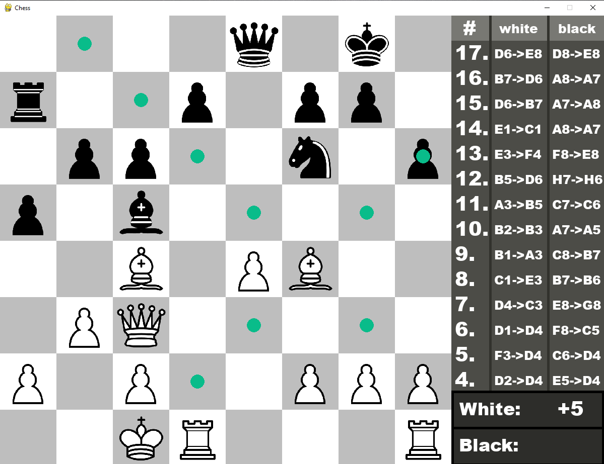

# PW_Szachy
## Classic Chess Made with Python
A college project that implements a chess game using Python. It highlights possible moves, shows checks, and detects checkmates. Each game can be saved as a .txt file, recording each move played by the players.
## How to execute?
1. Download project.
2. Use command `python ./chess.py`.
## Screenshots

